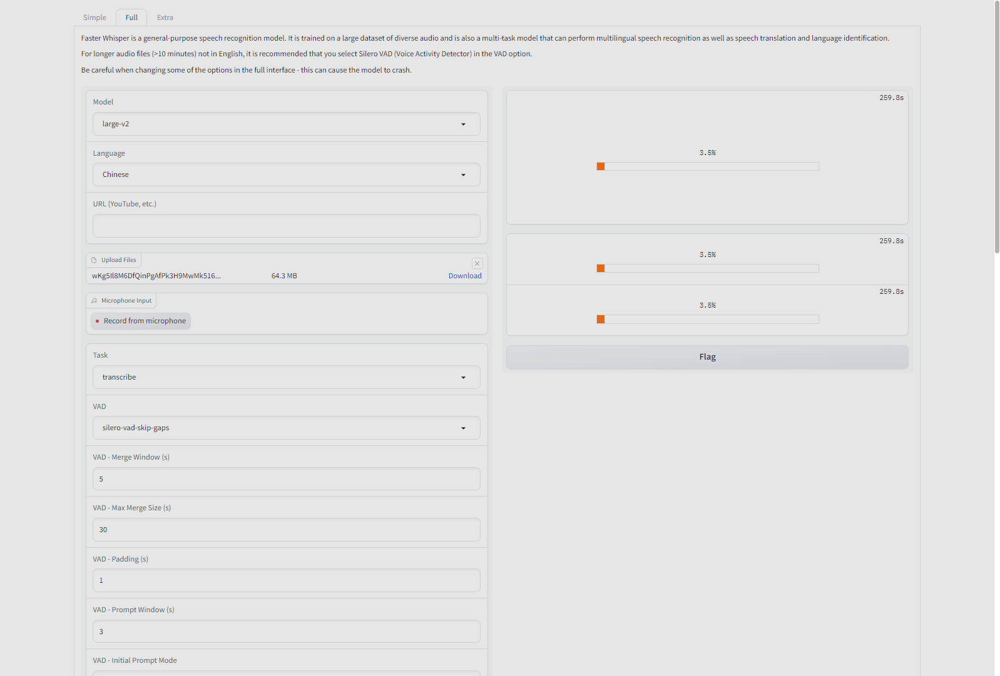
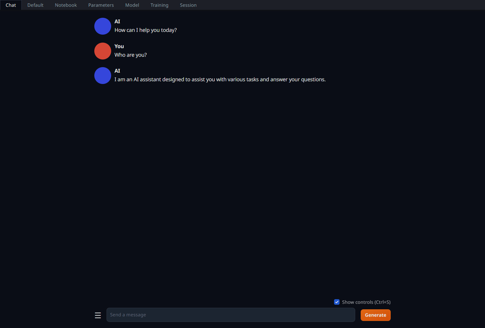
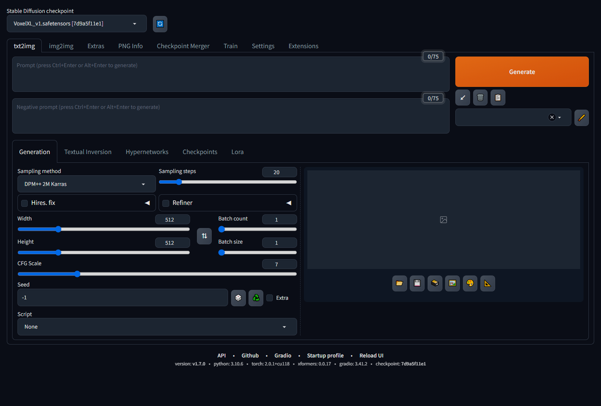
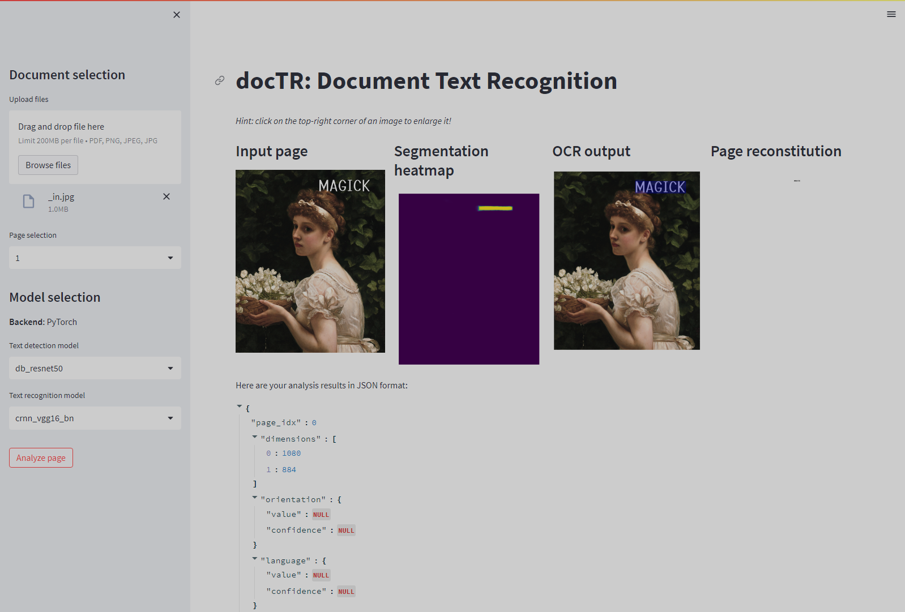
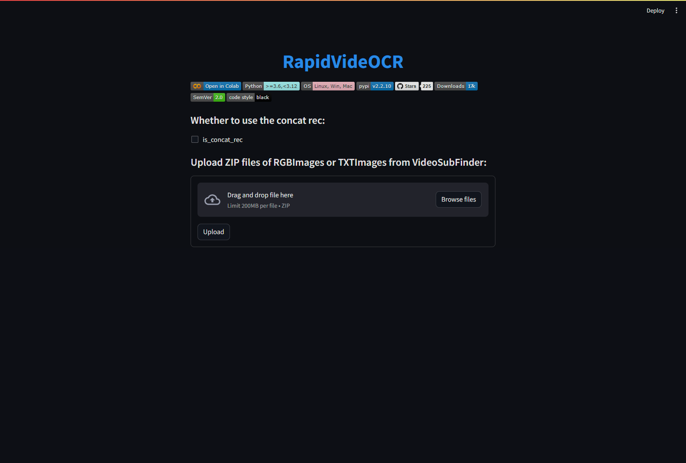
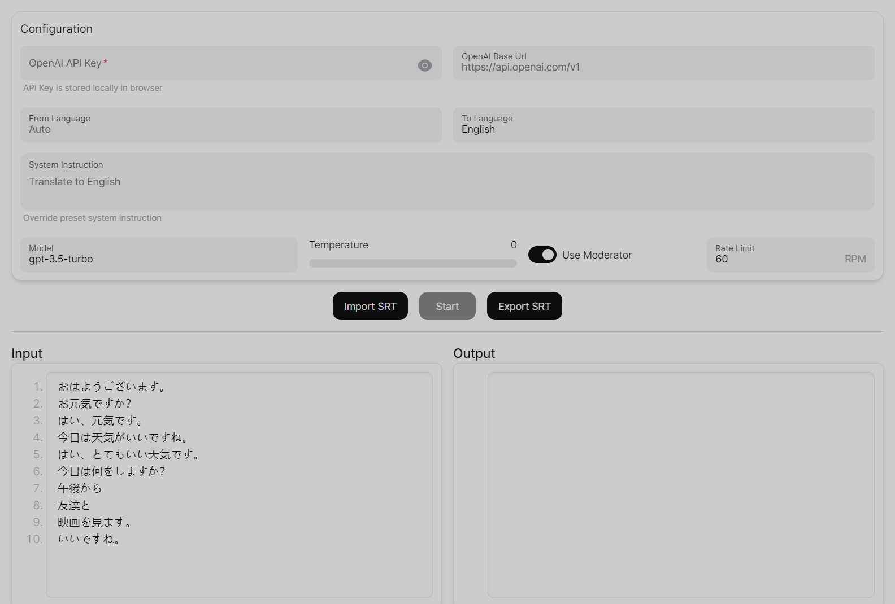

group | source | license | tested | readme | preview
:- | :- | :- | :- | :- | :-
a2t | [faster-whisper-webui](//huggingface.co/spaces/aadnk/faster-whisper-webui) |  | \ | [.md](_readme/faster-whisper-webui.md) | 
llm | [Text generation web UI](//github.com/oobabooga/text-generation-webui) |  | \ | [.md](_readme/text-generation-web-ui.md) |  |
llm | [Stable Diffusion web UI](//github.com/AUTOMATIC1111/stable-diffusion-webui) |  | \ | [.md](_readme/stable-diffusion-web-ui.md) | 
epub | [Calibre-Web](//github.com/janeczku/calibre-web) |  |  | [.md](_readme/calibre-web.md) | 
pdf | [docTR](//github.com/mindee/doctr) |  |  | [.md](_readme/doctr.md) | 
subtitle | [RapidVideOCR](//github.com/SWHL/RapidVideOCR) |  | \ | [.md](_readme/rapidvideocr.md) | 
subtitle | [ChatGPT API SRT Subtitle Translator](//github.com/Cerlancism/chatgpt-subtitle-translator) |  |  | [.md](_readme/chatgpt-subtitle-translator.md) | 